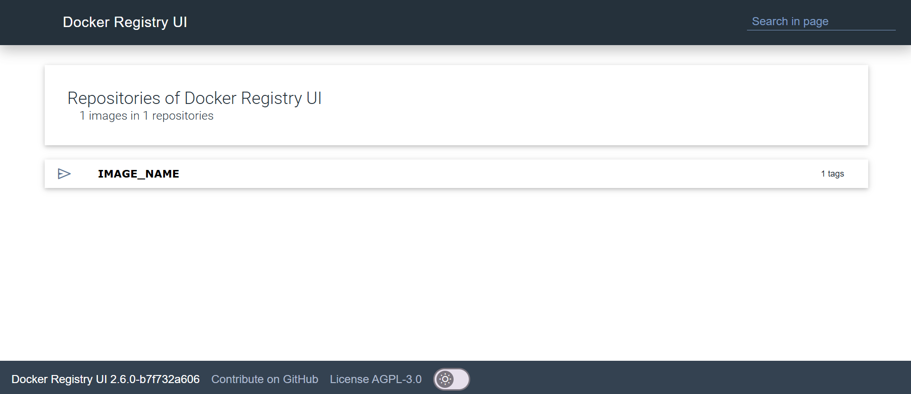

# 部署私人 Docker Registry 指南

部署私人 Docker Registry 和 UI，並將 映像(image) 推送至倉庫的指南。

## 使用 Docker 部署

參考 [docker-compose.yaml](docker-compose.yaml)  
```bash
docker compose up -d
```

Registry 運行於 `localhost:5000`  
UI 運行於 `localhost:80`  

## 設定本地 Docker

### Linux
```bash
sudo vim /etc/docker/daemon.json
```

新增以下內容
```
"insecure-registries": ["${REGISTRY_IP}:5000"]
```

重啟 Docker
```bash
systemctl daemon-reload
systemctl restart docker
```

### MAC 和 Windows

在 Docker Desktop/Settings/Docker Engine

新增以下內容
```
"insecure-registries": ["${REGISTRY_IP}:5000"]
```

點擊 `Apply & restart`

  

## 建立映像並推送

在你的專案目錄下  

建立映像
```bash
docker build -t ${IMAGE_NAME} -f ${DOCKERFILE_PATH} .
```

標籤映像
```bash
docker tag ${IMAGE_NAME} ${REGISTRY_IP}/${IMAGE_NAME}
```

推送映像
```bash
docker push ${REGISTRY_IP}/${IMAGE_NAME}
```

## UI 介面

