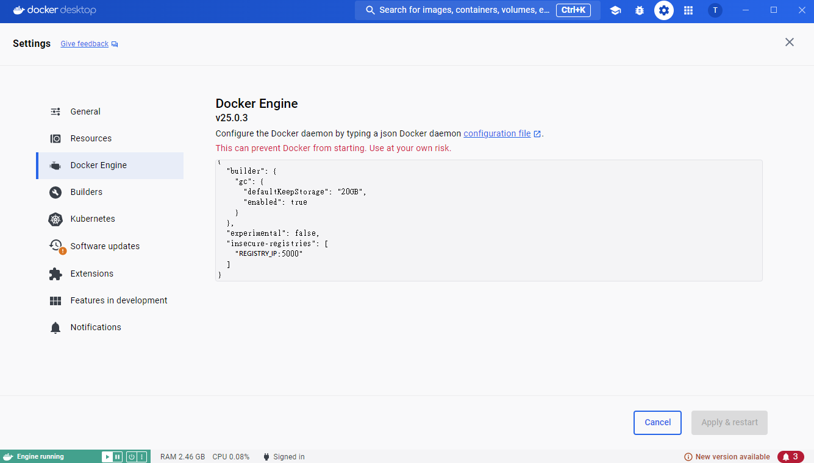

# Deploy Private Docker Registry Guide

**(also provided Traditional Chinese version document [README-CH.md](README-CH.md).)**

Guide for deploying Private Docker Registry and UI, and then push image to registry.

## Deploy By Docker

refer to [docker-compose.yaml](docker-compose.yaml)  
```bash
docker compose up -d
```

registry running at `localhost:5000`  
ui running at `localhost:80`  

## Set Local Docker

### Linux
```bash
sudo vim /etc/docker/daemon.json
```

add below
```
"insecure-registries": ["${REGISTRY_IP}:5000"]
```

restart docker
```bash
systemctl daemon-reload
systemctl restart docker
```

### MAC and Windows

Docker Desktop/Settings/Docker Engine

add below
```
"insecure-registries": ["${REGISTRY_IP}:5000"]
```

click `Apply & restart`

  

## Build Image And Push

at your project dir  

build image
```bash
docker build -t ${IMAGE_NAME} -f ${DOCKERFILE_PATH} .
```

tag image
```bash
docker tag ${IMAGE_NAME} ${REGISTRY_IP}/${IMAGE_NAME}
```

push image
```bash
docker push ${REGISTRY_IP}/${IMAGE_NAME}
```

## UI

